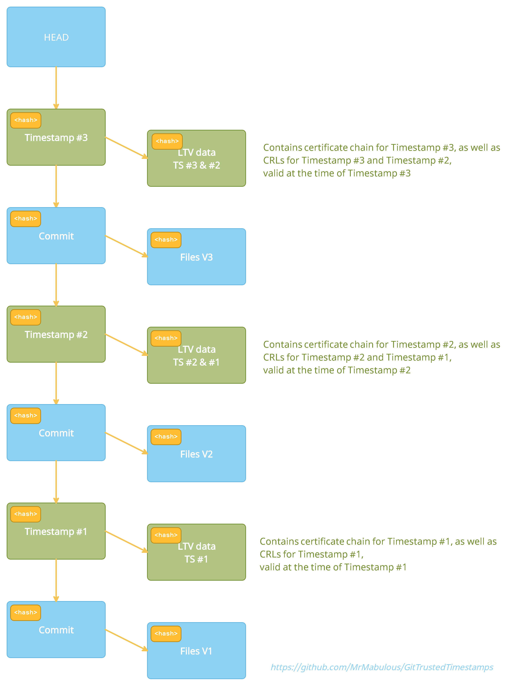

# GitTrustedTimestamps

RFC3161 and RFC5816 Timestamping for git repositories.

By using this post-commit hook in a repository and thereby adding secure timestamps to the commits it contains, the repository gains the following properties:
- Authenticity: trusted, non-refutable time when data was commited
- Integrity: protection of the timestamped data as well as the timestamps themselves from tampering without detection
- Timeliness: proof that the time of the digital signature (if used together with PGP signatures) was in fact the actual time
- An evidentiary trail of authenticity for legal sufficiency

# How to use this software

0. (optional, but recommended) If you're ceating a new repository, it is strongly recommended to use SHA256 hashes (git uses SHA1 by default at the time of writing) by initializing the repository using `git init --object-format=sha256` (Note: If you want to use a public hosting server such as github for your repository, you should check whether they already support SHA256 repositories). For more information, see https://git-scm.com/docs/hash-function-transition/
1. Copy the four bash scripts in the [hooks](hooks/) folder of this project into the .git/hooks folder of the project you want to timestamp.
2. Configure the TSA url you want to use (in this example https://freetsa.org/tsr) using  
`git config --local timestamping.tsa0.url https://freetsa.org/tsr`
3. You must declare that you trust this TSA by copying the root certificate of that TSA's trust chain into the .git/hooks/trustanchors folder (create it if it doesn't exist yet). The certificate MUST be in PEM format and the filename MUST be "subject_hash.0" where`subject_hash` is what openssl returns for the `--subject_hash` argument for x509 cetificates (https://www.openssl.org/docs/man1.1.1/man1/x509.html).  
**For your convenience, there is the [hooks/trust.sh](hooks/trust.sh) script which will do this for you.** To use it, simply run `.git/hooks/trust.sh https://freetsa.org/tsr` from your Git-Bash and confirm adding the certificate (Note: The certificates stored in .git/hooks/trustanchors are ONLY used to validate timestamp tokens, no other trust is established).
4. (optional) If you want to use multiple TSAs, just set additional urls for tsa1, tsa2 and so on. Make sure that they are all defined consecutively, for example, if you have a url defined for tsa0 and for tsa2, but not for tsa1, then tsa2 will be ignored. Since timestamp tokens will become forever invalid should a TSA's private key leak, using at least two trusted TSAs is a good strategy to protect against this unlikely eventuality (see chapter 4. "Security Considerations" of RFC3161 specification).
5. (optional) By default, a commit will fail if a timestamp token cannot be retrieved. If you want to make timestamping optional for a certain tsa, you can set  
`git config --local --type=bool timestamping.tsa0.optional true`.  
If `optional` is set to true and a timestamping token cannot be retrieved, you will receive a warning but the commit will be created nevertheless.
7. (optional) You might want to add this README.md and the [docs](docs/) folder or this repository to your repository as well, so that documentation of the timestamps is guaranteed to be available if the timestamps should be evaluated many years in the future.

From now on, every `git commit` will automatically tigger an additional commit that securely timestamps it.

# Implementation design

The design goals of this implementation are
- transparent simplicity (security without obscurity)
- using only "vanilla" git features to add the timestamps in order to stay as forward compatible as possible
- to not rely on new binaries (which would need to be trusted too). The software therefore is implemented as bash scripts and uses OpenSSL (https://www.openssl.org/) and git itself for all cryptographic operations.

A further goal was to leverage the inherent Merkle-Tree based design of git in order to create a tamperproof repository archive where no history can be rewritten without being noticed.  
By embedding the timestamps in the commit history, they form a hash-chain and thus new timestamps will cryptographically *seal* older ones and thereby additionally protect them from some forms of future invalidation.

# Merkle-Tree layout

The design leverages git's Merkle-Tree layout and embeds the timestmaps in the commit history, making them form a hash-chain that prevents later changes without being noticed:

Or as a further simplified schematic:

# What are RFC3161 and RFC5816 Timestamps

RFC3161 (https://tools.ietf.org/html/rfc3161) and its extension RFC5816 (https://tools.ietf.org/html/rfc5816) are protocol specifications to timestamp data using cryptographically secure tokens issued by an external, trusted third party TSA (Time Stamping Authority). By timestamping data this way, it is possible to prove to anyone who trusts this TSA service that the data existed already at the time of timestamping and has not been tampered with ever since. Only a secure hash of the data, without any identification, is being sent to the TSA service, so the data itself remains secret.

# Alternatives

Before writing this software, I evaluated alternatives available at the time of writing (Feb 2021). I will briefly list and discuss my findings here to outline the differences.

- There is a stackoverflow question (https://stackoverflow.com/questions/11913228/how-can-i-use-rfc3161-trusted-timestamps-to-prove-the-age-of-commits-in-my-git) and subsequently posted code review (https://codereview.stackexchange.com/questions/15380/adding-trusted-timestamps-to-git-commits):  
This script allows to manually create timestamps for revisions and store them in git-notes. This was not sufficient for me since having timestamps stored in git-notes makes them "cryptographically dangling" in the sense that the timestamped repository does not depend on them (meaning that they can be "lost" without being noticed). This may be the preferred solution for someone who just wants to be *able* to prove the time the code was created if he so desires, without creating a repository which is *tamperproof* (and without the benefits discussed further down). Also, the script does not take CRLs into consideration for validation.

- GitLock (https://www.npmjs.com/package/gitlock):  
GitLock adds timestamps as tags, which, like git-notes, also won't make the timestamped repository cryptographically depend on the timestamps themselves and thus offers the same advantages/disadvantages as the script above. It also creates a parallel SHA256 hierarchy (which isn't necessary anymore, since git now provides native SHA256 support) and depends on a Node.js application that must be installed and used manually. This solution may be preferred if the same conditions hold as with the first altenative and additionally SHA256 is required but a public git server which does not yet support native SHA256 commit hashes is used.

- There is [this](https://gitlab.cs.fau.de/CSG/git-rfc3161) fork of git:  
The fork was created as part of a university project to add native support for RFC3161 tokens to git. There is a corresponding discussion in the archived git mailing list (http://git.661346.n2.nabble.com/Adding-RFC-3161-timestamps-to-git-tags-td7650116.html). Since it requires a custom build of git and wasn't adopted by the official repo, I did not further investigate this implementation.

- There is [this](https://www.gwern.net/Timestamping#timestamping-version-control-systems) article discussing timestamping git repositories:  
It is using the OriginStamp (https://originstamp.com/) timestamping service. This solution does not use RFC3161 but instead relies on publication of hashes in public blockchains using the OriginStamp service (which comes with the advantages and disadvantages of blockchain transactions, such as long confirmation times and high fees).

- Zeitgitter (https://pypi.org/project/git-timestamp/):  
Zeitgitter seems to use a custom timestamping protocol and rely on developers cross-verifying their timestamps. Since it requires a custom client and server application and does not rely on RFC3161, I did not further investigate this implementation.

# How are timestamps added to commits

For each commit that is being timestamped, an additional *timestamp commit* is created, for which the commit that is being timestamped is the direct parent. The digest hash that is contained in the timestamp token is a hash derived from the commit hash of that parent commit as well as the tree hash of this *timestamp commit*. Since git itself is implemented as a [Merkle Tree](https://en.wikipedia.org/wiki/Merkle_tree), this hash hence depends on every bit of every commited file as well as the entire commit history, making it impossible to change anything without invalidating the timestamp. The timestamping token (one for each TSA for which a timestamp was retrieved from) is then added in PEM encoding (plus some info about the token in readable form) as a trailer to the commit message of the *timestamp commit*. Chosing this design to add the timestamps has several advantages:
- The commit hash always depends on the entire data of that commit (including the pgp signature that commit is signed with) and its history, meaning that not a single bit of data being committed (or the history it depends on) could be changed without creating a completely different commit hash.
- It is most likely the most forward-compatible option. If new commit headers or other commit data will be added to git in the future, they will most likely also be captured by the commit hash.
- By storing the tokens inside the commit message, which is hashed itself, rather than in git-notes or tags, subsequent commits will *seal* these timestamps, making it impossible to "lose" them, which gives the timestamping of the repository a *non-repudiation* property (https://en.wikipedia.org/wiki/Non-repudiation), meaning it will be impossible to "rewrite history" unnoticed.
- Since newer timestamps *seal* older timestamps (i.e. the older timestamps are part of what is being timestamped), this protects old timestamps from becoming invalid in some situations and can extend their validatability arbitrarily into the future (see Long Term Validation below). For example: Say in 2021 all commits are timestamped using a TSA that uses "certificateA" to sign its timestamps. Then in 2022 a TSA is used which uses "certificateB" to sign its timestamps. Then in 2023 the private key of "certificateA" leaks. Normally, if a TSA's private key leaks, all old timestamps become invalid and can't be trusted anymore (because the private key could be used to "backdate" data) - however, since in this case the timestamps of 2021, which are signed with the still trusted "certificateB" *sealed* the older timestamps, these old timestamps can still be considered valid, since they were provably created before the "certificateA" private key leaked. The same applies to old timestamps becoming invalid for example due to the algorithm used for them not being deemed secure anymore or if a CA stops issuing CRL data for the TSA certificate.

An altenative design that was considered but dismissed was to include the timestamps right into the commit message of the commit that is being timestamped (in order to keep the commit history more tidy), in a similar fashion as PGP signatures are added. PGP signatures do this by calculating the commit hash AS-IF the signature was not contained, then sign this hash and then add the signature into the commit header (thereby changing the hash). A similar approach could have been taken with the timestamps, but this would have two serious drawbacks:
1. Since PGP signatues are inserted natively AFTER the commit is generated, the timestamp token could therefore not timestamp the signature (instead, the signature would sign the timestamp, which is not useful).
2. Validation code would need to compute a commit hash AS-IF the timestamp-token was not contained, but also AS-IF any insertions happening AFTER timestamping were not present (at the time of writing, that's only PGP-Signatures. However, since future versions of git may include other additional headers in a similar fashion, this would break current timestamp validation code).

For these reasons, adding timestamps right into the commit that is being timestamped was dismissed, for separate *timestamp commits* are much more likely to be forward compatible with anything git will add to the commit object in the future.

Additionally to retrieving TSA tokens and timestamping the commits with them, the post-commit hook will also validate these tokens first to ensure that only valid, trusted time-stamp tokens are added. It does so by validating that:
- The received token corresponds to the request (a nonce sent in the request is being used for this).
- The token is valid and trusted.
- All certificates in the trust-chain up to a trusted anchor (stored in .git/hooks/trustanchors) are valid and have not been revoked (checked by downloading and checking CRLs for all certificates).

If a token does not pass these tests, it is not added and the commit is either aborted (if the TSA is not set to optional) or a warning is output (if the TSA is set to optional).

This repository uses the post-commit hook itself, so if you check the commit history of this repository, you will see that each commit is followed by a -----TIMESTAMP COMMIT----- that contains one or more timestamp tokens.  
For example, [this](https://github.com/MrMabulous/GitTrustedTimestamps/commit/67a93e8b5dc58f828e9f364ace03ac48a007c778) *timestamp commit* timestamps [this](https://github.com/MrMabulous/GitTrustedTimestamps/commit/6e9841d157c222e9bd79d6580dd029adccf55cde) regular commit, which is its direct parent. You can see that the "Digest" that is timestamped by the token is `bf8d5c510b87e22c06f3300e5dbe69f5c6a3f1e1=sha1(parent:6e9841d157c222e9bd79d6580dd029adccf55cde,tree:75be5fcd56edaff4da1fc31d3632da14618f7fc0)`, whereas the tree hash and parent hash in the preimage correspond to the parent and tree of this *timestamp commit*.
Since github did not support sha256 hashes yet at the time this repository was created, the hashing algorithm used is sha1 (for a repository initialized with `git init --object-format=sha256` the hashing algorithm will be sha256 or other, once git adds support for further algorithms)

# For how long are timestamps valid?

Generally, a RFC3161 timestamp can be trusted for as long as
- the private key of the signing certificate or a certificate in its trustchain did not get compromised and
- the hashing algorithm used by the timestamp and the signature algorithm used by the signing certificate is still considered secure

To be sure of the first point, one must know the current revocation status of the signing certificate. This in turn means that once new CRLs for the certificate that signed the timestamp are not issued anymore, the timestamp shouldn not be trusted anymore, since timestamps could be forged if the private key of the signing certificate leaked.  
However, if one has a copy of a historic CRL that shows the signature certificate to be valid, and which is timestamped by a timestamp that still can be trusted, then also the compromised timestamp can still be trusted.  
GitTrustedTimestamp enables this extension of the lifetime of timestamps by storing *Long Term Validation* data for previous timestamps with each new timestamp added.

# LTV - Long Term Validation:

Additionally to the bare timestamp tokens stored in the commit message as trailers, the *timestamp commit* also adds revisioned files to the .timestampltv folder. If the timestamps should be evaluated many years in the future, when the TSA does not exist anymore and the entire certificate chains of tokens for example can't be retrieved anymore, this *Long Term Validation* data will help to prove the validity of the tokens. For each timestamp in a *timestamp commit* two types files are stored:
1. .timestampltv/certs/issuer_hash.cer: This file contains the entire trust chain of the TSA certificate in PEM format (the first certificate being the TSA's signing certificate and the last being the self-signed root). In most cases this file will not change for subsequent timestamp tokens, so no additional data is added to the repository (the file content only changes when the TSA changes its signing certificate).
2. .timestampltv/crls/issuer_hash.crl: This file contains CRL responses in PEM format for all certificates in the trust chains of the new timestamp tokens at the time of timestamping. In most cases, this file will not change for subsequent timestamp tokens (or only a few lines plus the signature changes), so no or very little additional data is added to the repository (the file content only changes when the CRL lists referenced by certificates in the trust chain change).

Additionally to the LTV data of the newly added tokens, also the current CRL data of timestamps in the LAST *timestamp commit* will be added (in most cases, these will be the same as the CRLs for the new timestamps if still the same TSAs are used). This allows to extend the validatability of timestamps arbitrarily into the future, so long as new *timestamp commits* are added to the repository while the CA still provides CRL data for the most recently added timestamps (which they are often required to do for many years).

The `issuer_hash` for these files corresponds to the ESSCertID or ESSCertIDv2 hash using which the token identifies its issuer certificate. In general this is the SHA1 hash of the DER encoded issuer certificate for RFC3161 tokens, and some other hash of the DER encoded issuer certificate for RFC5816 tokens (the ESSCertIDv2 of the token specifies the used hashing algorithm).

# How to validate timestamps:

Ultimately the responsibility (and criteria) for validating the timestamps lies with the party who wishes to proof/disprove that they are valid and the policy being used.  
This repository does come however with an [implementation](hooks/validate.sh) that validates the created timestamps according to the criteria listed below. To use it, simply run `.git/hooks/validate.sh`

`validate.sh` will iterate over the entire commit history of the current branch and for each *timestamp commit* will:
- Check that the digest contained in the token matches the hash calculated based on parent hash and tree hash
- Checks that the TSA certificate was valid at the time of timestamping, by using historic CRL data
- Checks whether the TSA certificate or any intermediate certificate in the chain has been revoked and if so, whether the revocationCode matches the acceptable revocation reasons discussed in chapter 4 of the RFC3161 specification (https://tools.ietf.org/html/rfc3161)
- A commit containing multiple timestamps will be considered valid if there is at least one valid timestamp token (a warning will be printed if there are additional timestamps that are considered invalid)

To perform these checks, the same trusted rootCAs from the `.git/hooks/trustanchors` folder are used.
No other checks are performed. In particular, a timestamp-token is considered valid beyond the expiration date of its signing certificate if it hasn't been revoked due to a reason other than those specified in chapter 4.1 of the RFC3161 specification.  
The curent implementation of the validate.sh script also does not consider whether the hashing algorithms used in the timestamp-token or the keylength of the signing certificate are still considered secure, as this depends on what the validating party considers secure.

The script exits with exit code 0 if all tests passed, and with exit code 1 otherwise.

# Author

- Matthias Bühlmann